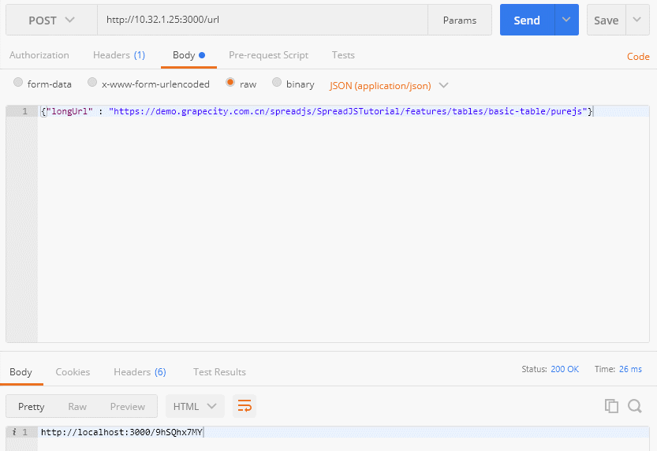
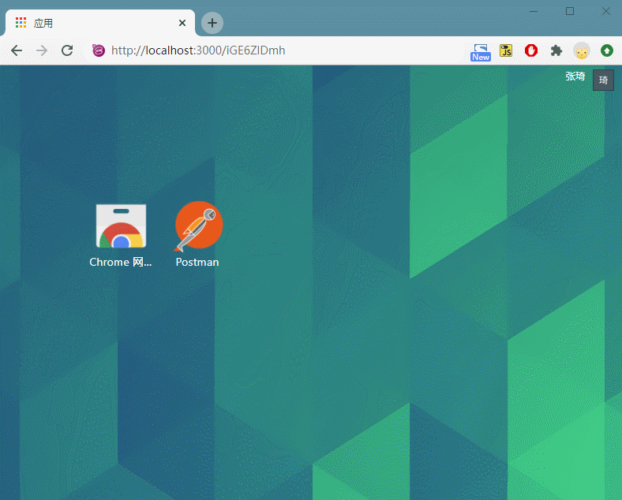

# How to Implement a Short Link Generator for Your Application
## Using Node & Mongodb in 3 steps with high efficiency

> In practical web applications, scenarios often arise where there is a need to generate QR codes from web authorization authentication addresses. If the URL length is overly long, the resulting QR code's density becomes too great, leading to difficulties in recognition by the camera.
> I was invited to compose this piece to share how I addressed this issue. This article is published under the name of the 'GrapeCity Technical Team' on the CNBlogs, with the original address as follows: https://www.cnblogs.com/powertoolsteam/p/shorturlgenerator.html

In such instances, it naturally comes to mind to use a short link to reduce the characters in the URL, making the generated code easier to recognize, while also making the URL more aesthetically pleasing and easier to share. 

Currently available on the market are Weibo's t.cn and some third-party short link generation tools. However, both types of tools have some usage issues. For example, the current rule for t.cn is that a redirect page will appear and it will not directly redirect. As for third-party tools, since they operate on a public platform, they may become inaccessible due to the presence of inappropriate content.

Given these circumstances, it might be better to implement our own short link platform. The principle behind creating a short link platform is relatively straightforward and can be accomplished in two parts: 1. Preserving the correspondence between long and short links, and 2. Redirecting by querying the long link through the short link.

For efficiency, I used Node.js and MongoDB for this task. Now, let's get started.

First, we need to create an Express project.

```cmd
express -e demo

change directory:
    > cd demo

install dependencies:
    > npm install

run the app:
    > SET DEBUG=demo:* & npm start
```

Then, import to the demo directory and install the necessary Express dependencies.

```
npm install
```

Simultaneously, use npm to install the mongoose, shortid and body-parser packages that we will be needing.

```
npm install mongoose
npm install shortid
npm install body-parser
```
Let's briefly explain the use of these three packages:

* In this application, we used MongoDB. We chose it because it operates efficiently with low overhead, so it also runs efficiently. However, using other databases would work as well. Here, mongoose is a package from npm, primarily providing the application with functionalities to connect to MongoDB and perform create, read, update, and delete operations.

* By using shortid, we can generate a unique, non-repetitive encoding, which helps us generate encodings similar to the red part in xxx.com/ngTsfdgh.

* As the API for generating our short link uses the POST method, the use of body-parser extends our ability to parse one more type of body encoding.

### First, set up the connection information for MongoDB.

```javascript
module.exports = {
    mongo_base_connection_url: 'mongodb://localhost:27017',
    mongo_db: 'mongodb://localhost:27017/shorturl',
    mongo_options: {
        autoReconnect: true,
        keepAlive: true,
        reconnectTries: 50,
        reconnectInterval: 1000,
        connectTimeoutMS: 5000000,
    }
}
console.log("Connection local mongo db");
```
### Database Model Definition

Since our correspondence needs to query the long link through the short link, our main focus here is storing the short link and long link. Additionally, you can also add fields such as link click counts based on your needs for future statistics.

```javascript
var mongoose = require('mongoose');
var Schema = mongoose.Schema;
 
var urlSchema = new Schema({
  shortUrl: String,
  longUrl: String
});
 
module.exports = mongoose.model('UrlTable', urlSchema);
```

### Defining Express Routes
Since our application only has the generation and redirection functionalities, all our work can be accomplished with just two pages.

```javascript
var index = require('./routes/index');
var url = require('./routes/url');
app.use('/', index);
app.use('/url', url);
```

### Short Link Generation Page
```javascript
const express = require("express");
const router = express.Router();
const shortId = require('shortid');
const UrlTable = require('../models/urltable');
const mongoose = require('mongoose');
var setup = require('../dbconfig/db');
 
router.post('/', function(req, res, next) {
    var params = req.body;
    var url = params.longUrl;
shortId.characters(' 0123456789abcdefghijklmnopqrstuvwxyzABCDEFGHIJKLMNOPQRSTUVWXYZ^*')
    var shortid = shortId.generate();
    var objurl = { shortUrl: shortid, longUrl: url};
    mongoose.connect(setup.mongo_db, setup.mongo_options);
    UrlTable.create(objurl, function (err, objurl) {
      //if (err) console.log(err);
      res.send("http://localhost:3000/" + shortid);
    });
    return;
});
```

### Specify the range for generating the shortId character and generate it:
```javascript
shortId.characters('0123456789abcdefghijklmnopqrstuvwxyzABCDEFGHIJKLMNOPQRSTUVWXYZ')
var shortid = shortId.generate();
```

### Construct a data model that meets requirements for the database:
```javascript
var objurl = { shortUrl: shortid, longUrl: url};
```

### Finally, connect to the database, save it, and return the short link result to the client:
```javascript
mongoose.connect(setup.mongo_db, setup.mongo_options);
UrlTable.create(objurl, function (err, objurl) {
    //if (err) console.log(err);
    res.send("http://localhost:3000/" + shortid);
});
```

### Short Link Redirection Page
```javascript
const express = require("express");
const router = express.Router();
const UrlTable = require('../models/urltable');
const mongoose = require('mongoose');
var setup = require('../dbconfig/db');
 
router.get('/:shortUrl', function (req, res, next) {
    var shortUrl = req.params.shortUrl;
    mongoose.connect(setup.mongo_db, setup.mongo_options);
    UrlTable.findOne({ shortUrl:shortUrl }).then((result) => {
       //待添加错误处理
    res.redirect(result.longUrl);
    })
});
 
module.exports = router;
```

For this page, to facilitate quick redirection, we use GET to receive parameters. The functionality of this page is quite straightforward - receive parameters, query, and redirect.

### Receiving the short link code
```javascript
var shortUrl = req.params.shortUrl;
```

### Connect to the database, query, and redirect.
```javascript
mongoose.connect(setup.mongo_db, setup.mongo_options);
UrlTable.findOne({ shortUrl:shortUrl }).then((result) => {
    res.redirect(result.longUrl);
})
```

Later on, you can enhance the application by handling errors and exceptions, along with data statistics. I won't go into detail about that here.

Now, let's enable the application and start testing.

### Launching the application and testing

```
npm start
```

After launching, the default access port is 3000. We will first test the short link generation page. Here, we POST a long link parameter named 'longUrl'. The data object is:

```json
{"longUrl" : "https://demo.grapecity.com.cn/spreadjs/SpreadJSTutorial/features/tables/basic-table/purejs"}
```



A short link as follows has been successfully generated:

http://localhost:3000/iGE6ZlDmh

As long as we can properly redirect to the saved long link by accessing the short link, it's fine.



The test passed. Actually, the amount of code isn't large and the principle is quite simple. If you have a shorter domain name, the link will become even shorter and more aesthetically pleasing after going live. 
Thus, we have completed the development of our own short link generation platform. The source code is attached below. By running npm install, all dependencies will be automatically installed. 
